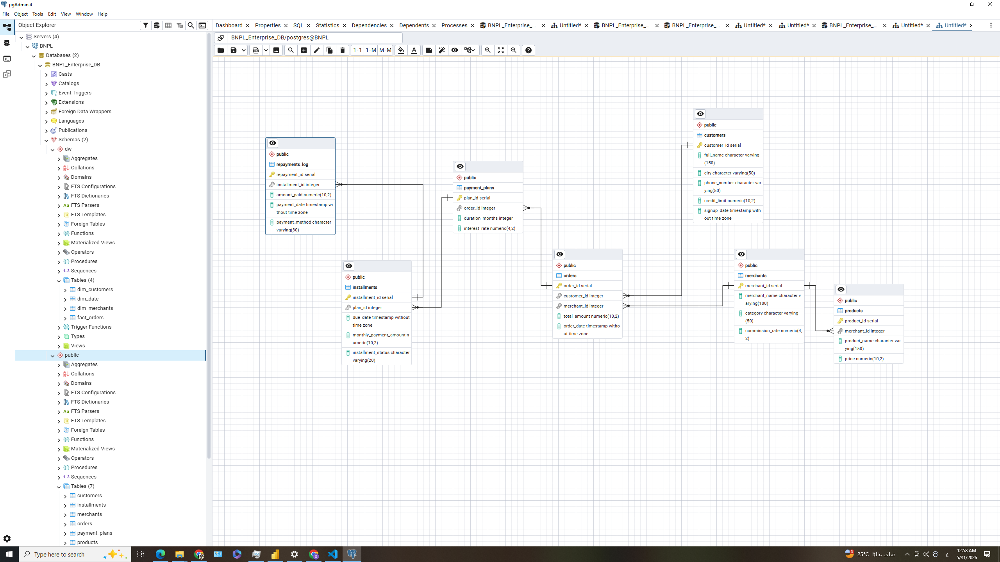
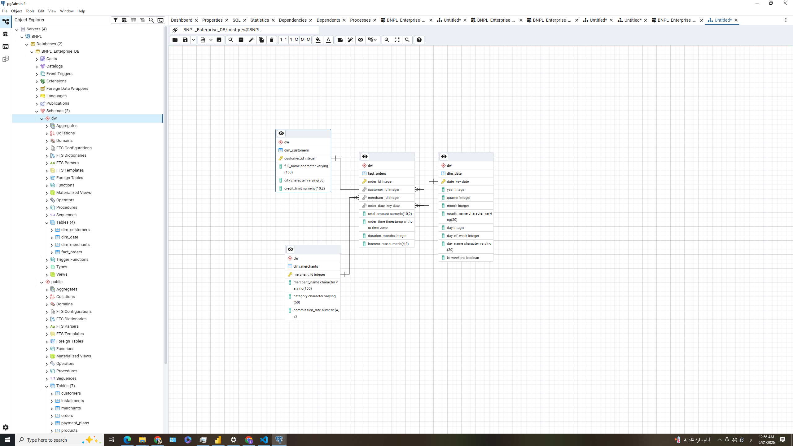
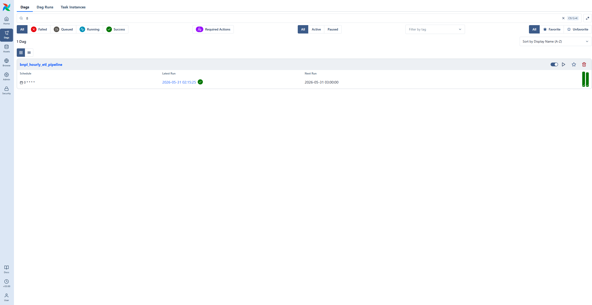
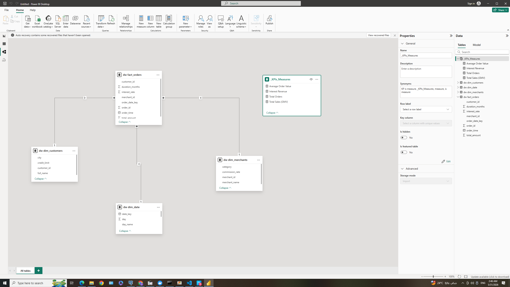

# FinTech Data Platform: BNPL & Merchant Risk Analytics

Hi there! This is an end-to-end data project that simulates how data actually flows in a production environment for a **Buy Now Pay Later (BNPL)** FinTech company. 

Instead of just downloading a boring, static Excel sheet and drawing some charts on it, I wanted to experience the real headache of building a full data pipeline from scratch—handling everything from raw data ingestion to automation and business dashboards.

---

## 🏗️ What I Used (Tech Stack)
* **Database & Warehouse:** PostgreSQL 15
* **Pipeline Automation:** Apache Airflow & Python (Pandas)
* **BI & Analytics:** Power BI Desktop & DAX

---

## 📐 Step 1: Building the Database & Data Warehouse (PostgreSQL)

In real companies, you can't just run heavy analytical queries on the live production database because it will slow down the whole app. So, I strictly separated the system into two different schemas inside **PostgreSQL**:

### 1. Live Operational DB (OLTP Staging)
This is where the raw data lands first. It tracks live user logs, payment plans, and raw incoming orders as they happen:

### 2. Analytical Data Warehouse (OLAP Star Schema)
This is where the magic happens. I transformed and moved the normalized staging data into a dedicated **Star Schema (`dw` schema)**. I built a centralized **Fact Table** (`dw.fact_orders`) and linked it to 3 clean **Dimension Tables** (Customers, Date, and Merchants) using One-to-Many relationships. This ensures that heavy analytical queries run in milliseconds without choking the system:

---

## 💻 Step 2: Automating the Whole Thing (Apache Airflow)

To make sure the Data Warehouse stays alive and updates itself without me running it manually every day, I wrote **Python scripts** to fetch new transaction batches, apply quality and cleaning checks, and push them to the warehouse. 

I orchestrated this whole process using **Apache Airflow**. As you can see below in the Airflow console, my DAG (`bnpl_hourly_etl_pipeline`) is active and running smoothly on an **hourly schedule** (all those beautiful green success circles):

---

## 📊 Step 3: Bringing the Data to Life (Power BI Modeling & Dashboards)

### 1. The Power BI Data Model
Inside Power BI, I replicated the exact Star Schema from the warehouse to keep the performance fast. All relationships are strictly enforced (`1:*`), and I isolated all my custom DAX metrics into a dedicated folder called `_KPIs_Measures` just to keep the workspace clean and professional:

### 2. The Final 3-Page Dashboard
I went with a clean dark theme that's easy on the eyes and built 3 specific pages to serve different people in the company:

#### Page 1: Executive Overview | Financial Performance
* **Who is it for?** C-Level Executives.
* **What does it prove?** It tracks high-level financial health at a glance. It shows our Gross Merchandise Value (GMV) hitting **$664M**, total orders at **25K**, and total interest revenue at **$33M**, alongside a monthly trend line.

#### Page 2: Merchant & Customer Analytics
* **Who is it for?** Product Operations & Growth Teams.
* **What does it prove?** It breaks down individual merchant volumes. The core **Area Chart** tracks order hours and proves a clear operational **peak trend exactly at 14:00 (2:00 PM)**. It also uses a modern Treemap to highlight our top VIP clients without cluttering the screen with massive tables.

#### Page 3: Risk, Loan & Interest Analytics
* **Who is it for?** Credit Risk & Risk Mitigation Officers.
* **What does it prove?** This is the most tactical page. It features an AI-powered **Decomposition Tree** that lets risk managers drill down and audit exactly where our interest is coming from (Vertical -> Merchant -> Loan Duration). It also uses a **Ribbon Chart** to map how merchant revenue ranks shift over the years, and a bar chart analyzing average user credit limits to spot high-exposure risk early.

---

## 🚀 How to Run this Project
1. Run the `.sql` files to set up the schemas inside your PostgreSQL instance.
2. Put the Python scripts into your Airflow `/dags` folder and toggle the DAG to active.
3. Open `PowerBI.pbix`, change the connection settings to point to your Postgres DB, hit refresh, and watch the data flow!
